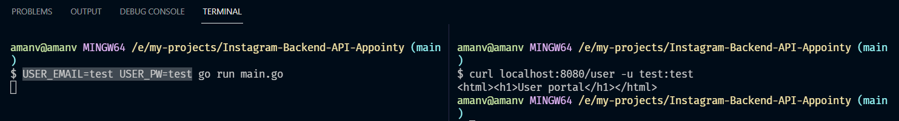
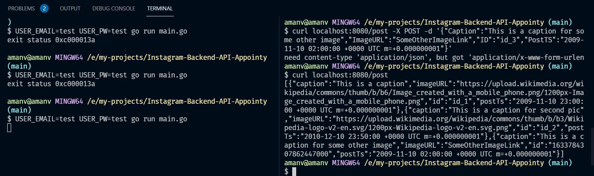
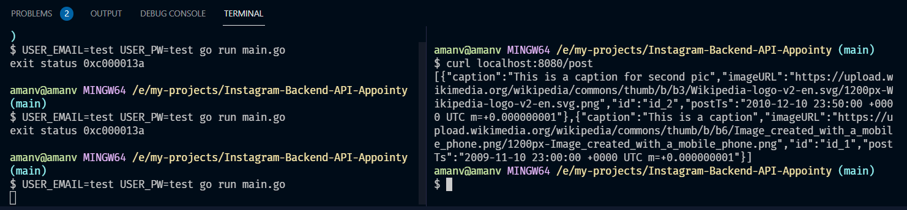
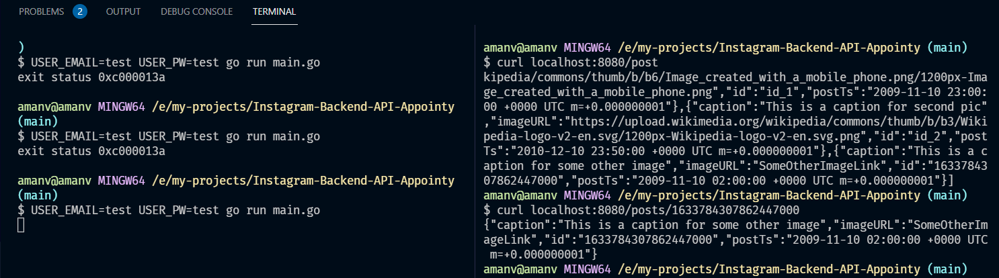

# Instagram-Backend-API-Appointy
Git repository for appointy TECH task


## Run
Run server with login credentials as a env variables

```USER_EMAIL=test USER_PW=test go run main.go
curl localhost:8080/user -u test:test
```



---

POST a post

```
curl localhost:8080/post -X POST -d '{"Caption":"This is a caption for some other image","ImageURL":"SomeOtherImageLink","ID":"id_3","PostTS":"2009-11-10 02:00:00 +0000 UTC m=+0.000000001"}' -H "Content-Type: application/json"
```



---

Get all the existing posts

```
curl localhost:8080/post`
```



---

GET a post by ID
```
curl localhost:8080/posts/1633784307862447000`
```


---

### Completed tasks

- [x] Create an User
- [ ] Get a user using id
- [x] Create a Post
- [x] Get a post using id
- [x] List all posts

## Note - API has been developed for local purposes only as of now.

